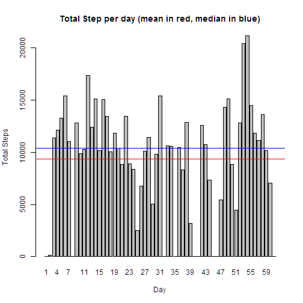
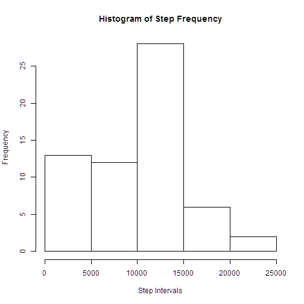
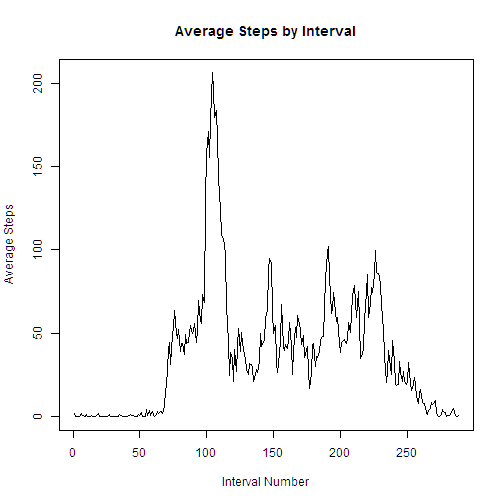
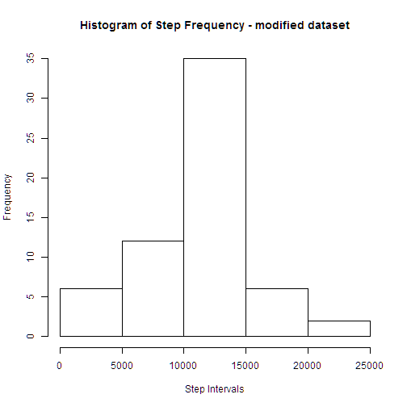

## Loading and preprocessing the data. 
###This dataset covers acitivity over 61 days from Oct 1 through Nov 30. We will refer to the days serially, i.e., day 1, day 2, ... day 61 .Each day consists of 288 5-minute intervals: 0-5, 5-10, ... 1435-1440. We will refer to the intervals serially also: int 1, int 2, ... int 288


```r
activ <- read.csv("activity.csv")

library(plyr)
activ_2 <- mutate(activ, date_2 = as.Date(as.character(activ$date)))

 v1 <- c(0)
 
for(i in 2:61){
  v1 <- c(v1, sum(activ_2$steps[activ_2$date_2 == as.Date(as.character(levels(activ_2$date)[i]))], na.rm=T))}

activ_3 <- data.frame(levels(activ_2$date), v1)
```

## Ignoring missing data, what is mean total number of steps taken per day?
###Here are the total steps taken per day and the mean and median values

```r
activ_3$v1
```

```
##  [1]     0   126 11352 12116 13294 15420 11015     0 12811  9900 10304
## [12] 17382 12426 15098 10139 15084 13452 10056 11829 10395  8821 13460
## [23]  8918  8355  2492  6778 10119 11458  5018  9819 15414     0 10600
## [34] 10571     0 10439  8334 12883  3219     0     0 12608 10765  7336
## [45]     0    41  5441 14339 15110  8841  4472 12787 20427 21194 14478
## [56] 11834 11162 13646 10183  7047     0
```

```r
meanSteps <- mean(activ_3$v1, na.rm=T)
medianSteps <- median(activ_3$v1, na.rm=T)
meanSteps
```

```
## [1] 9354.23
```

```r
medianSteps
```

```
## [1] 10395
```
###Below is a barplot showing total steps by day with the mean (red) and median (blue)lines superimposed

```r
barplot(activ_3$v, names.arg=c(1:61),main="Total Step per day (mean in red, median in blue)", xlab="Day", ylab="Total Steps")
abline(h=mean(activ_3$v), col="red")
abline(h=median(activ_3$v), col="blue")
```

 
###Below is the HISTOGRAM which was requested in the assignment

```r
hist(activ_3$v, main="Histogram of Step Frequency", xlab="Step Intervals", ylab="Frequency")
```

 


## What is the average daily activity pattern?
###Modify original dataframe to add interval numbers and then create vector of iterval averages to plot; ignore NAs

```r
 intervalCnt <- rep(c(1:288), 61)
activ_4 <- cbind(activ_2, intervalCnt)
intervalAvgs <- c()
for (i in 1:288){
 intervalAvgs <- c(intervalAvgs, mean(activ_4$steps[activ_4$intervalCnt==i], na.rm=T))
}
intDF <- data.frame(1:288, intervalAvgs)
names(intDF)[1]<-"Interval"

plot( intDF$intervalAvgs, type="l", main="Average Steps by Interval", xlab="Interval Number", ylab="Average Steps")
```

 

```r
maxInterval <- which.max(intDF$intervalAvgs)
maxInterval
```

```
## [1] 104
```

```r
intDF$intervalAvgs[maxInterval]
```

```
## [1] 206.1698
```

## Imputing missing values
###We first find the number of rows with NA's and then modify the dataframe to add dayOfWeek, factor it and order factors

```r
No_Of_NAs<-length(activ_2$steps[(is.na(activ_2$steps))])
No_Of_NAs
```

```
## [1] 2304
```
###We will find the day-of-week average, ignoring NA's, and use it to replace the NA's by day-of-week


```r
activ_5 <- mutate(activ_2, dayOfWeek = weekdays(as.Date(as.Date(as.character(activ_2[,4])),'%y-%m-%d')) )
activ_5$O_dayOfweek <- with(data=activ_5, 
  ifelse ((dayOfWeek == "Monday"),1, 
  ifelse ((dayOfWeek == "Tuesday"),2, 
  ifelse ((dayOfWeek == "Wednesday"),3, 
  ifelse ((dayOfWeek == "Thursday"),4, 
  ifelse ((dayOfWeek == "Friday"),5, 
  ifelse ((dayOfWeek == "Saturday"),6,7))))))) 
activ_5$O_dayOfweek <- factor(activ_5$O_dayOfweek, 
levels=1:7, 
labels=c("Mon", "Tue", "Wed", "Thur", "Fri", "Sat", "Sun")) 

  avgval <- c()
  avgval <- c(avgval, mean(activ_5$steps[levels(activ_5$O_dayOfweek)=="Mon"], na.rm=T))
  avgval <- c(avgval, mean(activ_5$steps[levels(activ_5$O_dayOfweek)=="Tue"], na.rm=T))
  avgval <- c(avgval, mean(activ_5$steps[levels(activ_5$O_dayOfweek)=="Wed"], na.rm=T))
  avgval <- c(avgval, mean(activ_5$steps[levels(activ_5$O_dayOfweek)=="Thur"], na.rm=T))
  avgval <- c(avgval, mean(activ_5$steps[levels(activ_5$O_dayOfweek)=="Fri"], na.rm=T))
  avgval <- c(avgval, mean(activ_5$steps[levels(activ_5$O_dayOfweek)=="Sat"], na.rm=T))
  avgval <- c(avgval, mean(activ_5$steps[levels(activ_5$O_dayOfweek)=="Sun"], na.rm=T))

avgval <- as.integer(avgval)


activ_5$steps[levels(activ_5$O_dayOfweek)=="Mon"]  <- replace(activ_5$steps[levels(activ_5$O_dayOfweek)=="Mon"], is.na(activ_5$steps[levels(activ_5$O_dayOfweek)=="Mon"]), avgval[1])

activ_5$steps[levels(activ_5$O_dayOfweek)=="Tue"]  <- replace(activ_5$steps[levels(activ_5$O_dayOfweek)=="Tue"], is.na(activ_5$steps[levels(activ_5$O_dayOfweek)=="Tue"]), avgval[1])

activ_5$steps[levels(activ_5$O_dayOfweek)=="Wed"]  <- replace(activ_5$steps[levels(activ_5$O_dayOfweek)=="Wed"], is.na(activ_5$steps[levels(activ_5$O_dayOfweek)=="Wed"]), avgval[1])

activ_5$steps[levels(activ_5$O_dayOfweek)=="Thur"]  <- replace(activ_5$steps[levels(activ_5$O_dayOfweek)=="Thur"], is.na(activ_5$steps[levels(activ_5$O_dayOfweek)=="Thur"]), avgval[1])

activ_5$steps[levels(activ_5$O_dayOfweek)=="Fri"]  <- replace(activ_5$steps[levels(activ_5$O_dayOfweek)=="Fri"], is.na(activ_5$steps[levels(activ_5$O_dayOfweek)=="Fri"]), avgval[1])

activ_5$steps[levels(activ_5$O_dayOfweek)=="Sat"]  <- replace(activ_5$steps[levels(activ_5$O_dayOfweek)=="Sat"], is.na(activ_5$steps[levels(activ_5$O_dayOfweek)=="Sat"]), avgval[1])

activ_5$steps[levels(activ_5$O_dayOfweek)=="Sun"]  <- replace(activ_5$steps[levels(activ_5$O_dayOfweek)=="Sun"], is.na(activ_5$steps[levels(activ_5$O_dayOfweek)=="Sun"]), avgval[1])
v2 <- c(0)
 
for(i in 2:61){
  v2 <- c(v2, sum(activ_5$steps[activ_5$date_2 == as.Date(as.character(levels(activ_2$date)[i]))], na.rm=T))}

activ_6 <- data.frame(levels(activ_5$date), v2)

meanSteps1 <- mean(activ_6$v2, na.rm=T)
medianSteps1 <- median(activ_6$v2, na.rm=T)
meanSteps1
```

```
## [1] 10510.95
```

```r
medianSteps1
```

```
## [1] 10395
```

```r
hist(activ_6$v2, main="Histogram of Step Frequency - modified dataset", xlab="Step Intervals", ylab="Frequency")
```

 

## Are there differences in activity patterns between weekdays and weekends?


```r
aintervalCnt <- rep(c(1:288), 61)
activ_7 <- cbind(activ_6, aintervalCnt)
#weekend <- subset(activ_7, (levels(activ_7$O_dayOfweek=="Sat")&(levels(activ_7$O_dayOfweek=="Sun"))
#head(weekend)
```
intervalAvgs <- c()
for (i in 1:288){
 intervalAvgs <- c(intervalAvgs, mean(activ_4$steps[activ_4$intervalCnt==i], na.rm=T))
}
intDF <- data.frame(1:288, intervalAvgs)
names(intDF)[1]<-"Interval"
