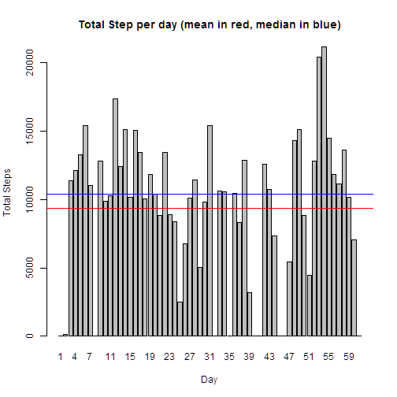
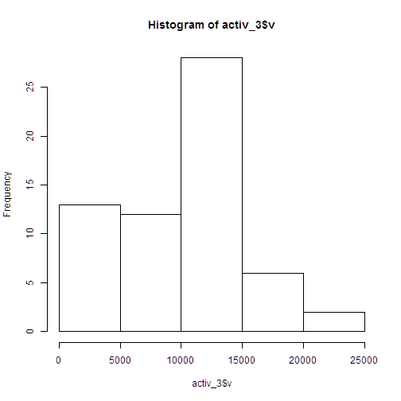

## Loading and preprocessing the data

```r
activ <- read.csv("activity.csv")

library(plyr)
activ_2 <- mutate(activ, date_2 = as.Date(as.character(activ$date)))

 v1 <- c(0)
 
for(i in 2:61){
  v1 <- c(v1, sum(activ_2$steps[activ_2$date_2 == as.Date(as.character(levels(activ_2$date)[i]))], na.rm=T))}

activ_3 <- data.frame(levels(activ_2$date), v1)
```

## What is mean total number of steps taken per day?

```r
barplot(activ_3$v, names.arg=c(1:61),main="Total Step per day (mean in red, median in blue)", xlab="Day", ylab="Total Steps")
abline(h=mean(activ_3$v), col="red")
abline(h=median(activ_3$v), col="blue")
```

 

```r
summary(activ_3)
```

```
##  levels.activ_2.date.       v1       
##  2012-10-01: 1        Min.   :    0  
##  2012-10-02: 1        1st Qu.: 6778  
##  2012-10-03: 1        Median :10395  
##  2012-10-04: 1        Mean   : 9354  
##  2012-10-05: 1        3rd Qu.:12811  
##  2012-10-06: 1        Max.   :21194  
##  (Other)   :55
```

```r
hist(activ_3$v)
```

 


## What is the average daily activity pattern?


## Imputing missing values


## Are there differences in activity patterns between weekdays and weekends?
